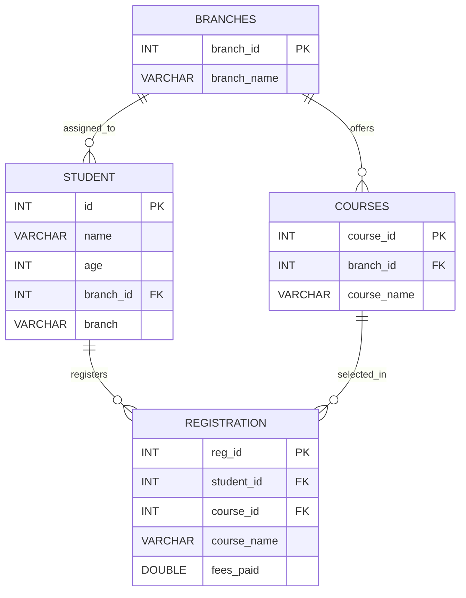

# Student Course Registration & Fee Management System

A console-based Java + JDBC application for managing students, branches, courses, and course registrations in a training institute.

The application follows a layered architecture:

- `src/Main.java` — bootstrap only
- `src/ui/ConsoleMenu.java` — console menu and user interaction
- `src/input/ConsoleInput.java` — reusable input helpers
- `src/services/*` — business logic
- `src/dao/*` — JDBC persistence layer
- `src/model/*` — data models
- `src/validation/*` — validation rules and reusable validators
- `src/exceptions/*` — custom application exceptions
- `src/util/DBUtil.java` — database connection and schema initialization

## Technologies used

- Java
- JDBC
- MySQL
- Console-based UI

## Main capabilities

### Student management

1. Add student
   - validates ID, name, age, and branch selection
   - checks duplicate student ID immediately
2. Search student by ID
   - shows student details
   - lists all registered courses for that student
3. Update student
   - submenu:
	 - update name
	 - update age
	 - update branch
   - when branch changes, registrations are aligned to the new branch
4. Delete student
   - deletes registrations first, then student
   - uses transaction management

### Branch management

5. Add new branch
6. Show all branches

### Course management

7. Add new course under a branch
8. Show all courses
9. Course selection is branch-aware
   - when registering, the app shows only courses under the student's branch

### Registration management

10. Register for course
	- validates student exists
	- prevents duplicate registration
	- uses transaction management
11. Update course fee
	- updates fees by student ID only
12. Cancel registration
	- removes only the selected course registration

### Reports

13. View all students with courses
	- includes students with no registrations using `LEFT JOIN`
14. High paying students report
	- displays students with fees above a threshold
15. Course-wise student count report

## Database schema

`DBUtil.initializeDatabase()` creates and maintains the schema automatically.

### Tables

#### `branches`

- `branch_id` INT PRIMARY KEY AUTO_INCREMENT
- `branch_name` VARCHAR(50) NOT NULL UNIQUE

#### `courses`

- `course_id` INT PRIMARY KEY AUTO_INCREMENT
- `branch_id` INT NOT NULL
- `course_name` VARCHAR(50) NOT NULL
- `UNIQUE(branch_id, course_name)`
- Foreign key: `branch_id -> branches.branch_id`

#### `student`

- `id` INT PRIMARY KEY
- `name` VARCHAR(50) NOT NULL
- `age` INT NOT NULL
- `branch_id` INT NULL
- `branch` VARCHAR(50) NOT NULL
- Foreign key: `branch_id -> branches.branch_id`

> Note: `branch` is still stored for backward compatibility and display, while `branch_id` is the main relational link.

#### `registration`

- `reg_id` INT PRIMARY KEY AUTO_INCREMENT
- `student_id` INT NOT NULL
- `course_id` INT NULL
- `course_name` VARCHAR(50) NOT NULL
- `fees_paid` DOUBLE NOT NULL
- Foreign keys:
  - `student_id -> student.id`
  - `course_id -> courses.course_id`

> Note: `registration` stores both `course_id` and `course_name` so the app can work with current and legacy data paths.

## ER diagram



## Menu options

1. Add Student
2. Register for Course
3. View All Students with Courses
4. Search Student by ID
5. Update Student
6. Update Course Fee
7. Cancel Registration
8. Delete Student
9. High Paying Students Report
10. Course-wise Student Count
11. Add New Course
12. Add New Branch
13. Show All Branches
14. Show All Courses
15. Exit

## Validation and exception handling

- Input rules are centralized under `src/validation/`
- Custom exceptions are used for:
  - validation errors
  - duplicate records
  - missing records
  - database failures
- The UI catches these exceptions and shows user-friendly messages instead of crashing

## Transactional operations

### Register for course

- Input validation:
  - student ID > 0
  - course ID > 0
  - fee > 0
- Failure conditions:
  - student does not exist
  - course does not exist
  - course does not belong to the student's branch
  - duplicate registration
  - DB insert failure
- Atomic work:
  - existence checks + registration insert
- Risk if not atomic:
  - duplicate or partial registration data

### Delete student

- Input validation:
  - student ID > 0
- Failure conditions:
  - student does not exist
  - registration delete failure
  - student delete failure
- Atomic work:
  - delete registrations + delete student
- Risk if not atomic:
  - orphan registrations or inconsistent student state

### Update branch

- Input validation:
  - student ID > 0
  - branch ID > 0
- Failure conditions:
  - student not found
  - branch not found
  - branch update failure
  - course alignment failure
- Atomic work:
  - update student branch + align registrations

## Setup and run

### Database configuration

Environment variables supported by `DBUtil.java`:

- `DB_URL`
- `DB_USER`
- `DB_PASSWORD`

Default URL:

```text
jdbc:mysql://localhost:3306/student_management?useSSL=false&allowPublicKeyRetrieval=true&serverTimezone=UTC
```

### Run with Maven

```zsh
cd "/Users/milendrakumarbaghel/Documents/java-workspace/Student Management System"
mvn -q -DskipTests compile
mvn -q exec:java
```

### Run with javac/java

```zsh
cd "/Users/milendrakumarbaghel/Documents/java-workspace/Student Management System"
find src -name "*.java" -print0 | xargs -0 javac -d out
java -cp out Main
```

## Notes

- All JDBC queries use `PreparedStatement`
- Resource handling uses `try-with-resources`
- Tables are auto-created and lightly migrated on startup
- Some legacy text columns still exist alongside foreign keys to preserve compatibility with older data
